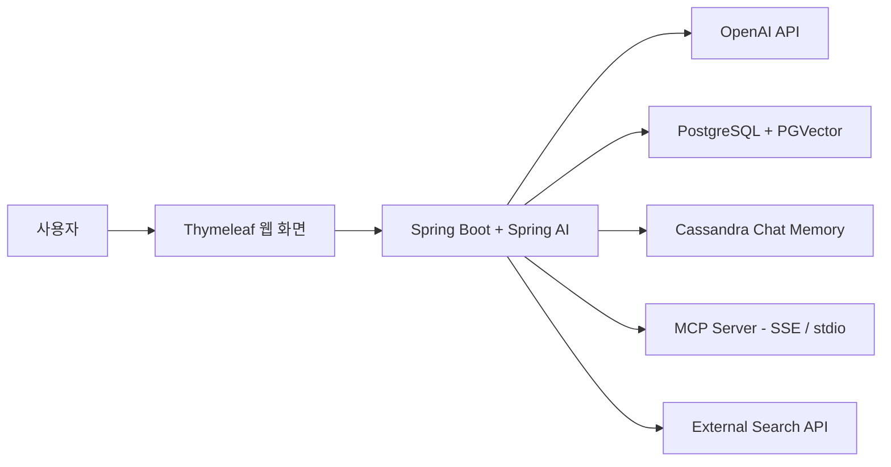

# Spring AI Portfolio

Spring Boot와 Spring AI를 활용해 생성형 AI, RAG, 벡터 검색, 대화 메모리, MCP, AI Agent 기능을 구현한 실습·포트폴리오 프로젝트입니다.

## 주요 기능

- OpenAI 기반 채팅 및 프롬프트 엔지니어링
- 문서 임베딩과 PGVector 유사도 검색
- RAG 기반 문서 질의응답
- JDBC·PGVector·Cassandra 기반 대화 메모리
- MCP SSE / stdio 클라이언트·서버 연동
- 외부 검색 도구를 호출하는 YouTube 검색 AI Agent

## 기술 스택

- Java 21
- Spring Boot
- Spring AI
- OpenAI API
- PostgreSQL + PGVector
- Cassandra
- MCP (SSE, stdio)
- Thymeleaf
- Gradle

## 아키텍처

## 실행 방법
1. 환경 변수 설정
export OPENAI_API_KEY=발급받은_OpenAI_API_키
export SERPAPI_API_KEY=SerpApi_키
export POSTGRES_PASSWORD=PostgreSQL_비밀번호
export CASSANDRA_PASSWORD=Cassandra_비밀번호

Windows PowerShell에서는 다음처럼 설정합니다.
$env:OPENAI_API_KEY="발급받은_OpenAI_API_키"
$env:SERPAPI_API_KEY="SerpApi_키"
$env:POSTGRES_PASSWORD="PostgreSQL_비밀번호"
$env:CASSANDRA_PASSWORD="Cassandra_비밀번호"

2. 프로젝트 실행
cd 프로젝트_폴더
./gradlew bootRun

Windows에서는 다음 명령을 사용합니다.
.\gradlew.bat bootRun

실행 후 브라우저에서 http://localhost:8080으로 접속합니다.

## 환경 변수
변수명	설명	필요한 프로젝트
OPENAI_API_KEY	OpenAI API 키	전체 AI 기능
SERPAPI_API_KEY	웹·YouTube 검색 API 키	Agent, Tool Calling
POSTGRES_PASSWORD	PostgreSQL 비밀번호	RAG, PGVector, JDBC 메모리
CASSANDRA_PASSWORD	Cassandra 비밀번호	Cassandra Chat Memory

API 키와 비밀번호는 GitHub에 업로드하지 않으며, 환경 변수로만 관리합니다.

